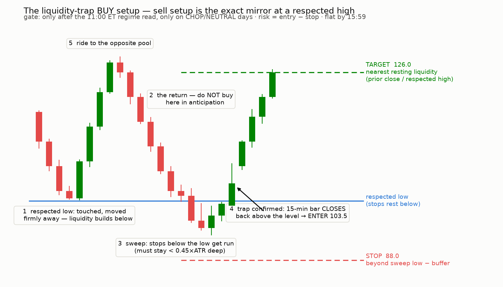
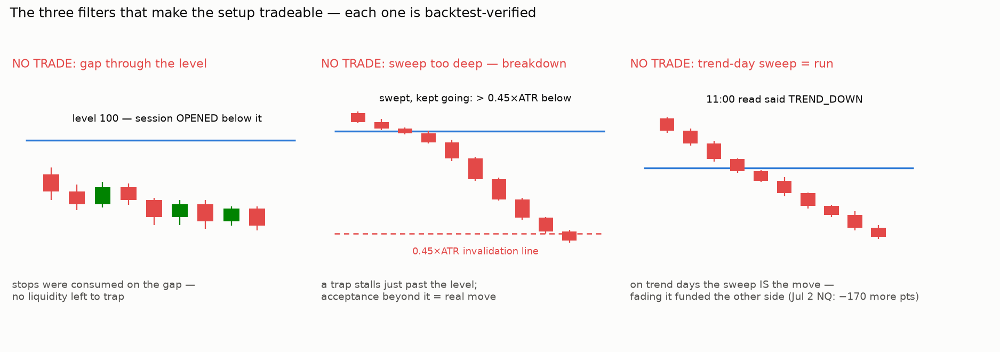
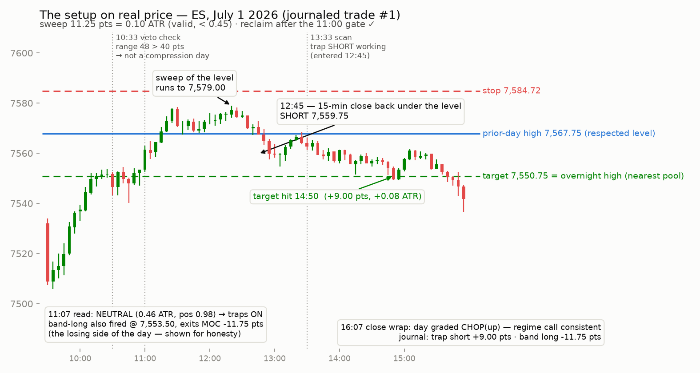

# Liquidity-trap setup guide (visual)

Companion to `liquidity_playbook.md`. Three charts: the anatomy, the three
no-trade filters, and journaled trade #1 on real price with the system's
daily check-ins overlaid.

**Checklist per setup (full detail):**
1. Level respected: touched, moved firmly away, left intact; prior close
   >= 0.15 ATR from the level; not consumed by an opening gap.
2. Regime read done (11:00 ET): CHOP or NEUTRAL only. TREND = traps off.
3. Sweep: price trades through the level; sweep depth < 0.45 ATR.
4. Trap confirmed: FIRST 15-min close back inside the level, and it must
   occur at/after 11:00 (an earlier reclaim = setup skipped, never chased).
5. Enter market at the reclaim close. Stop beyond the sweep extreme +- 0.05
   ATR. Target the nearest resting pool (prior close first). Flat by 15:59.
6. Size = fixed risk / (entry - stop). Max ~2 setups/day.

The real-trade chart also shows the day's four system check-ins (10:33 veto,
11:07 read, 13:33 scan, 16:07 wrap) including the band-long that lost -11.75
pts the same day the trap short made +9.00: two rule-sets, both followed,
one won - that is what a normal day of a positive-expectancy process looks
like.
