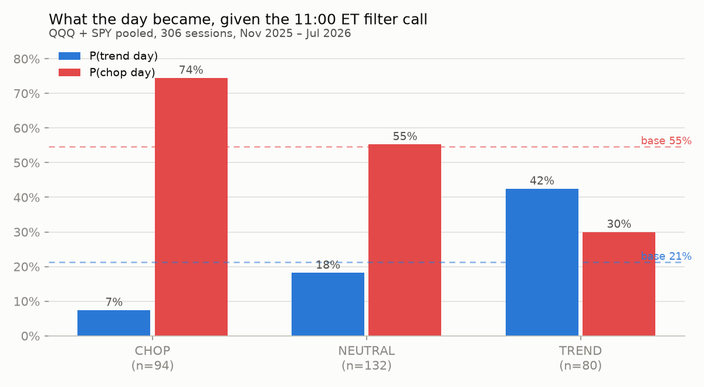
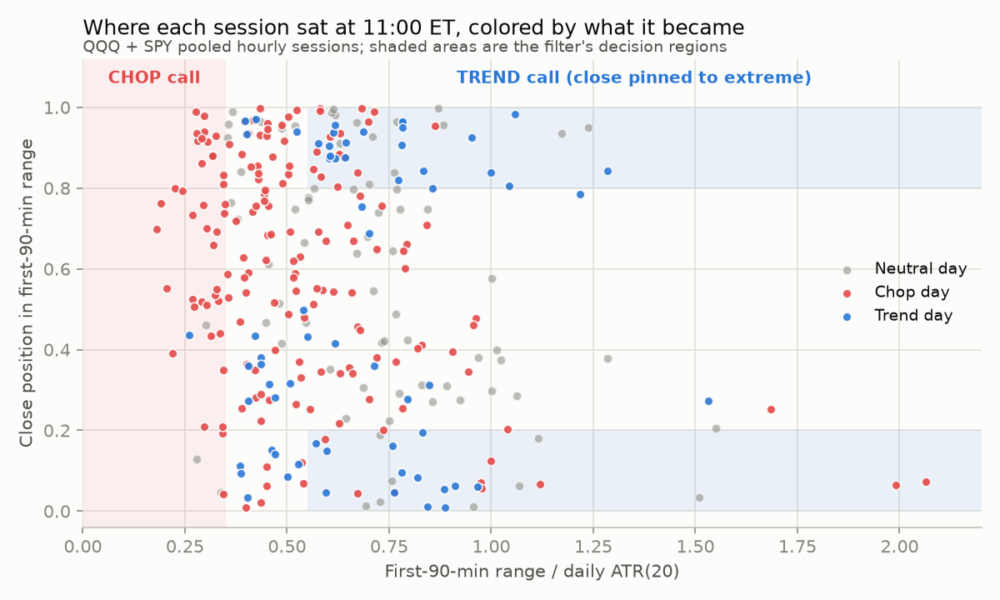
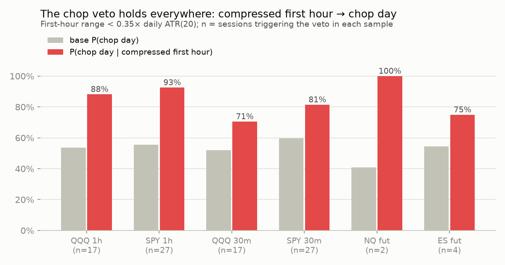

# Trend vs. Chop: a mechanical regime filter for NQ/ES day trading

**Data:** IBKR price history via the connected account. QQQ/SPY used as NQ/ES proxies —
validated, not assumed: 30-min RTH return correlation over the overlapping month is
**0.999 (NQ↔QQQ)** and **0.997 (ES↔SPY)**. Samples:

| Dataset | Window | Purpose |
|---|---|---|
| QQQ, SPY daily OHLC | Jul 2021 – Jul 2026 (1,253 sessions) | pre-open predictor study, ATR context, day-type labels |
| QQQ, SPY 1-hour RTH | Nov 2025 – Jul 2026 (153 sessions each) | main intraday study + filter validation |
| QQQ, SPY 30-min RTH | Mar 2026 – Jul 2026 (77 sessions each) | 10:30 checkpoint test |
| NQ, ES front-month futures, 1-hour & 30-min incl. Globex | May/Jun 2026 – Jul 2026 | proxy validation + spot-check on the real instruments |

IBKR intraday history is capped at 1,000 bars per request, which sets the window lengths.

## 1. Defining the thing being predicted

Each RTH session is labeled ex post from its OHLC:

- **Directional range capture (DRC)** = |close − open| / (high − low). 1.0 = pure trend day, ~0 = round trip.
- **Range expansion** = (high − low) / prior-day ATR(20).

| Label | Rule | Meaning |
|---|---|---|
| **TREND** | DRC ≥ 0.60 **and** range ≥ 0.80×ATR | big directional day, continuation pays |
| **CHOP** | DRC ≤ 0.35 **or** range ≤ 0.70×ATR | round trip or compression, continuation bleeds |
| NEUTRAL | everything else | |

A violent wide-range round-trip day labels CHOP (the veto wins over the trend rule) —
correct for a continuation trader. Base rates 2021–2026: **TREND ≈ 25%, CHOP ≈ 50%,
NEUTRAL ≈ 25%** on both QQQ and SPY. Chop is the default state of the market; trend is
the exception you must detect.

## 2. Negative result first: daily indicators do not predict tomorrow

Every "trend regime" indicator commonly used as a day-trading filter was tested on
5 years × 2 symbols, quintiled, against the next session's day type
(`scripts/study_daily.py`):

| Predictor (known at prior close) | P(TREND) Q1→Q5 (QQQ) | Verdict |
|---|---|---|
| ADX(14) | 0.24 → 0.28 | flat — no signal |
| Efficiency ratio (10d) | 0.28 → 0.27 | flat — no signal |
| EMA8–EMA21 distance / ATR | 0.27 → 0.27 | flat — no signal |
| Prior day's DRC | non-monotone | noise |
| NR7 / inside day | ≈ base | no signal (SPY NR7 actually leans *chop*: 0.575 vs 0.517) |
| **ATR(5)/ATR(20) vol ratio** | **0.22 → 0.30**, P(CHOP) 0.57 → 0.43 | modest, consistent on both symbols |
| **Opening gap / ATR** (known 9:30) | **0.22 → 0.30**, P(CHOP) 0.58 → 0.43 | modest, consistent on both symbols |

**Conclusion:** whether tomorrow trends is essentially unknowable the night before.
What persists is *volatility state*, not direction-of-trendiness: expanding recent vol
and a large opening gap shift the odds a little. A daily-ADX regime filter for day
trading is a placebo. The regime has to be read **from the session itself**.

## 3. The session tells you by 11:00

At the 11:00 ET checkpoint (first 90 minutes, i.e. the 9:30 and 10:00 hourly bars),
three numbers were tested against the rest of the day (`scripts/study_intraday.py`):

- **FH range / ATR(20)** — how much of a normal day's range printed already
- **FH position** — where price sits inside the first-hour range (0 = low, 1 = high)
- **FH efficiency ratio** — |net move| / path length (directional vs. rotational tape)

Findings, consistent across QQQ/SPY, both bar sizes, and directionally on NQ/ES:

1. **Compression is destiny.** FH range < 0.35×ATR → P(CHOP) 0.71–0.93, P(TREND) 0–6%
   in every sample (fig 3). Range expansion happens early or not at all.
2. **Location matters more than momentum.** Close pinned to the top/bottom 20% of the
   FH range roughly doubles P(TREND) (0.24–0.45 vs. 0.10–0.16 mid-range).
3. **Median follow-through is ~zero everywhere.** This is a *regime* filter for playbook
   and size selection — not a naive "buy the 10:30 breakout" edge by itself.

## 4. The mechanical filter (as validated)

Two checkpoints, four numbers, no discretion (`regime/filter.py`):

```
10:30 ET — chop veto
    OR60 = first-hour high-low range
    if OR60 / ATR20 < 0.35  →  CHOP: stand down continuation plays now

11:00 ET — full read (first 90 min: range R/ATR20, close position POS, efficiency ER)
    TREND_UP    if R ≥ 0.55 and POS ≥ 0.80
    TREND_DOWN  if R ≥ 0.55 and POS ≤ 0.20
    CHOP        if R < 0.35   (range veto)
    CHOP        if ER < 0.40 and 0.20 < POS < 0.80  (rotation veto)
    NEUTRAL     otherwise
```

Thresholds are deliberately round numbers sitting on plateaus, not optimized knife
edges. Validation on pooled QQQ+SPY hourly sessions (306 sessions, Nov 2025 – Jul 2026):

| 11:00 call | P(TREND day) | P(CHOP day) | n | lift |
|---|---|---|---|---|
| **TREND** | **0.425** | 0.300 | 80 | 2.0× base trend rate |
| NEUTRAL | 0.182 | 0.553 | 132 | ≈ base |
| **CHOP** | 0.074 | **0.745** | 94 | trend risk cut to ⅓ |

- On TREND calls the session **closed in the called direction 82.5%** of the time.
- Stability: the same ranking holds in each half of the sample and per symbol
  (TREND-call P(TREND) 0.33–0.50, CHOP-call P(CHOP) 0.67–0.82 in every split).
- NQ/ES spot-check (tiny n, direction only): NQ TREND calls 6/6 correct day direction.
- The packaged filter reproduces the study classification exactly
  (153/153 sessions, `scripts/check_filter.py`).
- The 30-min sample shows the **trend confirmation is not reliable at 10:30** —
  only the compression veto is. Hence two checkpoints, not one.

A continuous 0–100 score (for sizing) plus the pre-open priors from §2 (gap, vol
ratio) as a ±8 nudge is included in `read_1100()`.





## 5. How to use it

- **CHOP call** → no continuation/breakout entries; mean-reversion at range extremes or
  flat; if you must trade momentum, half size and take profits at the opening-range edge.
- **TREND call** → continuation playbook only in the called direction; pullback entries
  toward VWAP/OR edge; hold a runner into the close (trend days close near the extreme
  by construction of the stats above).
- **NEUTRAL** → base rates apply; trade smaller, demand better locations.
- The one thing the data most strongly supports: **when the first hour is compressed,
  stop trading for range extension.** That single veto removes ~⅓ of sessions on which
  P(TREND) is ~7%.

## 6. Honest limitations

1. **Intraday validation window is 7.5 months** (a grinding-up tape with one vol spike).
   The IBKR 1,000-bar cap prevents older intraday history; the 5-year daily study covers
   2021–2026 regimes but only for the pre-open (weak) signals.
2. Labels and features share the session's first 90 minutes mechanically (a wide FH range
   contributes to the day's range). The mitigation is that outcomes were also measured
   on *rest-of-day* quantities (`med|rod|/ATR`, direction hits), which are out-of-window.
3. Futures samples (22 sessions) are directionally confirmatory, nothing more.
4. Thresholds were chosen on the same sample they're reported on. Treat the exact
   probabilities as in-sample; the *ordering* (compression → chop; expansion + pinned
   close → trend) is the robust claim.

## 7. Taking it forward

1. **Extend the intraday sample.** Pull 1-hour bars in 1,000-bar chunks monthly from IBKR
   (or a flat-file vendor) until 3+ years, then re-fit thresholds walk-forward.
2. **Wire it live**: at 10:30/11:00 ET pull the session's bars via the IBKR MCP tools,
   feed `TrendChopFilter`, and log the call + score to a journal. Grade it weekly against
   the ex-post label — the filter is falsifiable by design.
3. **Add the overnight session for NQ/ES**: overnight range/ATR and whether RTH opens
   inside/outside overnight range (needs more futures history than one contract month).
4. **Condition your actual setups** on the three states and measure expectancy per state.
   That — not the label hit rate — is the final acceptance test.
5. Candidate refinements worth testing, in order: 15:00 re-read for late-day trend days
   missed at 11:00; VWAP-side persistence as a fourth input; event-day exclusions
   (FOMC/CPI) which are likely a separate regime class.
